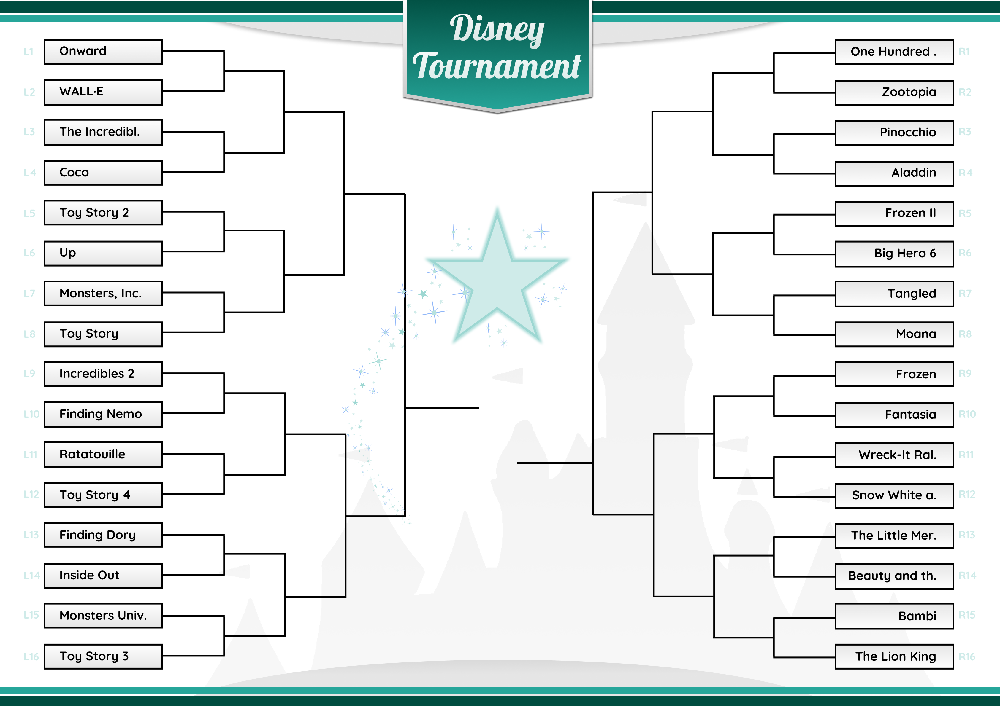
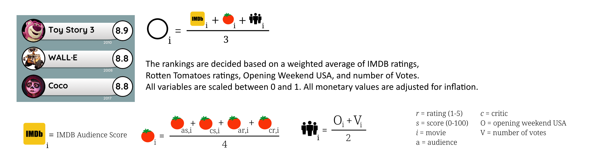
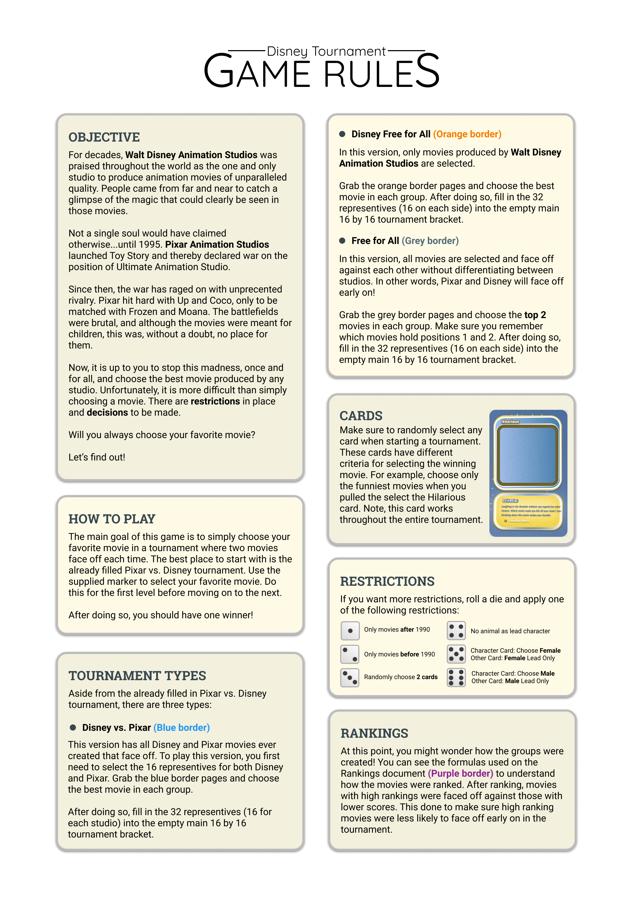

> Code and instructions for creating Disney vs. Pixar tournament based on 
IMDB and RottenTomatoes data

This is a game that I made for a friend who loves the movies from
Walt Disney Animation Studios. The basic principle is a simple tournament in which Disney
movies are pitted against Pixar movies. It is up to you to decide the best movie! 

**NOTE**: All images of movies and characters used in this project are owned by Disney  


## Table of Contents  
<a name="toc"/></a>
<!--ts-->
   1. [About the Project](#about)
   2. [Getting Started](#gettingstarted)  
        2.1. [Scraper](#scraper)  
        2.2. [Seed Score](#seed)   
        2.3. [Images](#images)  
   3. [Game](#game)  
<!--te-->

---
<a name="about"/></a>
## 1. About the Project
[Back to ToC](#toc)  
The main goal of this game is to simply choose your favorite movie in a tournament 
where two movies face off each time. The best place to start with is the already filled 
Pixar vs. Disney tournament. Select the movie you enjoy most and move on to the next 
level until you have a winner!  

In order to make the tournament interesting, I created a seed score for each movie
based on their IMDB and RottenTomatoes scores and performance. Initially, higher scoring movies will face off against movies with lower scores in the hope
that higher scoring movies will only face off later in the tournament. 


 
---
<a name="gettingstarted"/></a>
##  2. Getting Started
[Back to ToC](#toc)  

The code can be divided in roughly three parts: 
* Scraping IMDB and RottenTomatoes
* Creating the Seeding Scores
* Creating the Visualizations

If you want to use the game itself itself without running any code, please look in
the folder **images/results**.

If you want to re-create the results without running scraper, simply run  
  
```python main.py```

from the **src** folder. 

<a name="scraper"/></a>
###  2.1. Scraper
To newly scrape the data, simply run the following: 
  
```python
from imdb_scraper import scrape as imdb_scraper
from rotten_scraper import scrape as rotten_scraper
imdb_pixar, imdb_disney = imdb_scraper(save=True)
rotten_pixar, rotten_disney = rotten_scraper(save=True)
```

<a name="seed"/></a>
###  2.2. Seed Score  

The basic formula for creating the seed score for each movie is:  




<a name="images"/></a>
###  2.3. Images  

If you want to have images beside each title, create a folder named **images/thumbnails**
which you have to manually fill with an image for each movie (80 in total) that **exactly**
match the title as displayed in the data. 

I refrained from uploading the images as I am sure they are copyrighted, but was not sure
if it would fall under fair use or not. 

---
<a name="game"/></a>
##  3. Game
[Back to ToC](#toc)  

To play the game, use all images in the **Game** folder and simply follow the following 
rulebook:



